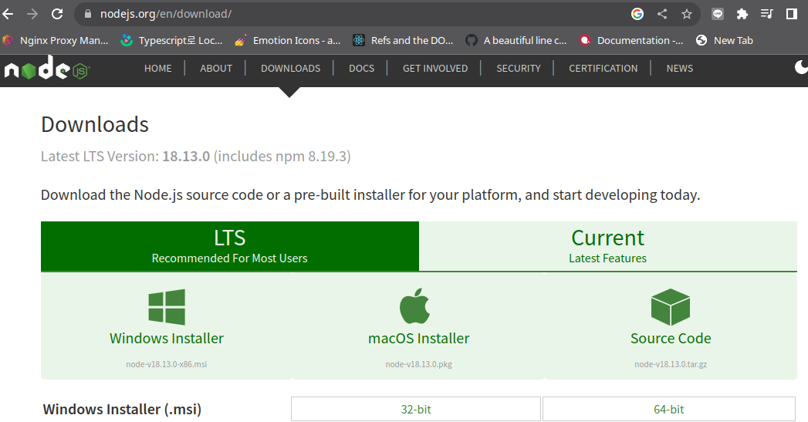
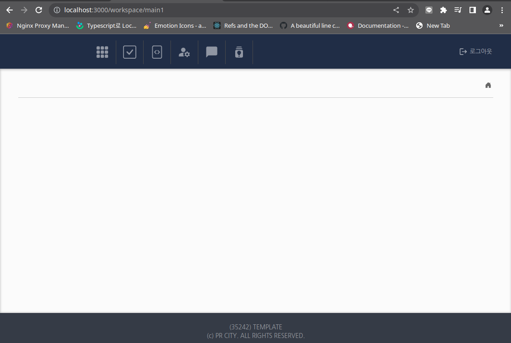

# 설치 
- windows 
  - 해당 프로그램을 실행하기 위해서 nodejs 인스톨 필요 
  - Latest LTS Version: 18.13.0 (includes npm 8.19.3)
  
 

# form
- https://react-hook-form.com/kr/ts (form 체크)

# 아이콘 검색
- https://emotion-icons.dev/


# 실행 방법
```
# node module 인스톨 
$npm install 
# 실행
$npm start
> react-start@0.1.0 start
> react-app-rewired start --host 0.0.0.0

(node:12946) [DEP_WEBPACK_DEV_SERVER_ON_AFTER_SETUP_MIDDLEWARE] DeprecationWarning: 'onAfterSetupMiddleware' option is deprecated. Please use the 'setupMiddlewares' option.
(Use `node --trace-deprecation ...` to show where the warning was created)
(node:12946) [DEP_WEBPACK_DEV_SERVER_ON_BEFORE_SETUP_MIDDLEWARE] DeprecationWarning: 'onBeforeSetupMiddleware' option is deprecated. Please use the 'setupMiddlewares' option.
Starting the development server...
Compiled successfully!

You can now view scouter-xp in the browser.

  Local:            http://localhost:3000
  On Your Network:  http://172.30.1.43:3000

Note that the development build is not optimized.
To create a production build, use npm run build.

assets by path static/js/*.js 3.53 MiB
  assets by chunk 105 KiB (id hint: vendors)
    asset static/js/vendors-node_modules_axios_index_js.chunk.js 59.5 KiB [emitted] (id hint: vendors) 1 related asset
    asset static/js/vendors-node_modules_emotion-icons_bootstrap_CheckSquare_CheckSquare_esm_js-node_modules_emot-dafe6a.chunk.js 31.8 KiB [emitted] (id hint: vendors) 1 related asset
    asset static/js/vendors-node_modules_emotion_styled_base_dist_emotion-styled-base_browser_esm_js.chunk.js 13.9 KiB [emitted] (id hint: vendors) 1 related asset
  asset static/js/bundle.js 3.22 MiB [emitted] (name: main) 1 related asset
  asset static/js/src_layouts_Workspace_index_tsx.chunk.js 93.9 KiB [emitted] 1 related asset
  asset static/js/src_hooks_useInput_ts-src_styles_globalStyles_tsx.chunk.js 57.7 KiB [emitted] 1 related asset
  asset static/js/src_pages_Main1_index_tsx.chunk.js 33.4 KiB [emitted] 1 related asset
  asset static/js/src_pages_Login_index_tsx-src_styles_colors_tsx.chunk.js 21.8 KiB [emitted] 1 related asset
  asset static/js/node_modules_web-vitals_dist_web-vitals_js.chunk.js 6.9 KiB [emitted] 1 related asset
asset asset-manifest.json 2.56 KiB [emitted]
asset index.html 754 bytes [emitted]
cached modules 6.24 MiB [cached] 3801 modules
runtime modules 35.2 KiB 19 modules
webpack 5.75.0 compiled successfully in 2705 ms
Files successfully emitted, waiting for typecheck results...
Issues checking in progress...
No issues found.

``` 
# 실행 성공후 
http://localhost:3000 아래 실행 결과를 확인 할수 있음 

 